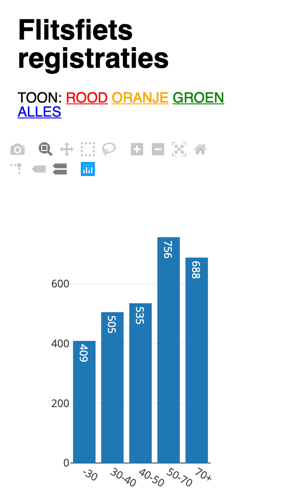
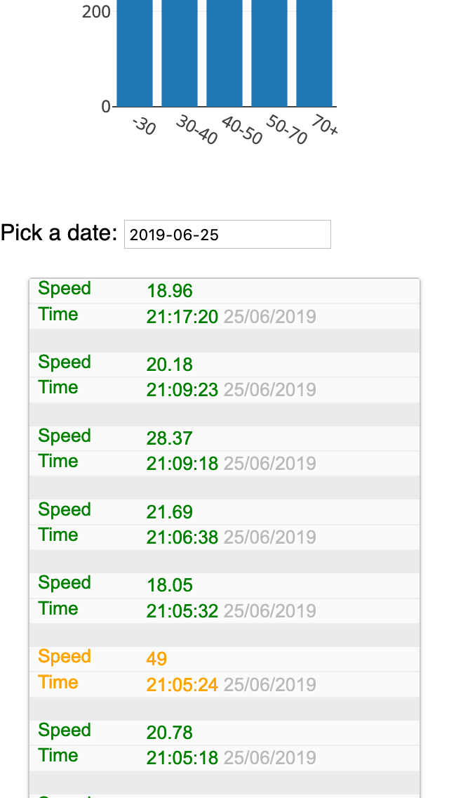

# Web interface for [Flitsfiets](https://github.com/aliekens/flitsfiets) registrations

## System Requirements

- PHP 7
- Sqlite

You can use [PhpLiteAdmin](https://www.phpliteadmin.org/) to administer your Sqlite database online.

## Functionality

This application provides 2 features:

#### 1. An endpoint for the [Particle.io webhooks](https://docs.particle.io/tutorials/device-cloud/webhooks/)

The endpoint path can be set in the .env file

#### 2. A dashboard where we can see the registrations per day

This is a very basic, hacked-together dashboard. It displays graph using the plotly api.



## Installation

- Clone git repository
- Run ```Composer install```
- Create a .env file with settings
- rename database/example.sqlite to the value you have in ```DB_FILE``` in your .env file 

